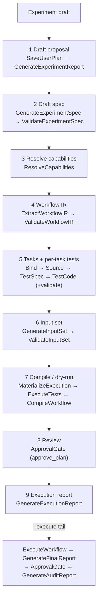
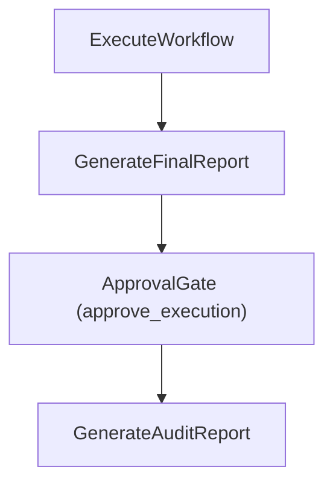

# Plan Mode Architecture

PlanMode turns a natural-language experiment draft into a fully verified,
reviewed plan plus a descriptive execution report — in **nine visible
steps**. It is the **single `Mode` pipeline in `molexp.harness`** (the top
layer of the dependency DAG); the earlier PlanMode/RunMode split is retired.
The nine steps end at the execution report; real scientific execution is an
**opt-in tail** (`PlanMode(execute=True)` / `molexp plan --execute`) that runs
the workflow for real and writes the final + audit reports.

> PlanMode used to be a `molexp.agent` mode built on `molexp.workflow`, and
> the back half lived in a separate `RunMode`. It now lives in the harness
> as one ordered list of `Stage` objects with an opt-in execution tail. The
> harness reaches the LLM only through the agent's `Router` Protocol
> (`RouterBackedAgentGateway`), and it never loads the workflow engine
> in-process — pytest and the materialized workflow driver run as executor
> subprocesses.

## A Mode is a stage ledger

A `Mode` is an ordered list of `Stage`s run against one
content-addressed `Run`. `Mode.stages(user_input)` returns the
sequence; the runner executes each `Stage.run(ctx) -> ArtifactRef`,
brackets it with `stage_started` / `artifact_created` / `stage_completed`
events, and auto-wires `derived_from` lineage between artifacts. Each
completed stage is recorded in a ledger keyed by the Run's fingerprint,
so re-running the **same draft** resumes on the same Run and skips
already-completed stages.

Run-level provenance (params, config hash, code/script identity) is
owned by **workspace** (`RunMetadata` / `AssetCatalog`). Harness lineage
covers only the agent-pipeline artifacts and stamps each edge with its
stage plus the workspace `run_id`.

## PlanMode flow (9 steps)



1. **Draft proposal** — `SaveUserPlan`, `GenerateExperimentReport` capture
   the request and draft a human-readable experiment report.
2. **Draft spec** — `GenerateExperimentSpec` concretizes every parameter
   into a provenance-carrying `ExperimentSpec` and resolves the report's
   open questions; `ValidateExperimentSpec` checks coverage. Stored as JSON;
   the YAML view is rendered at the CLI/server boundary.
3. **Resolve capabilities** — `ResolveCapabilities` queries the
   `CapabilityRegistry` (molmcp) and emits the `capability_catalog` as its
   own step. `BindMolcraftsTasks` (step 5) consumes it.
4. **Workflow IR** — `ExtractWorkflowIR` lifts the *concrete spec* into a
   workflow IR (flow + topology); `ValidateWorkflowIR` checks it.
5. **Tasks + per-task tests** — `BindMolcraftsTasks` / `ValidateBoundWorkflow`
   bind IR nodes to concrete tasks; `GenerateWorkflowSource` /
   `ValidateWorkflowSource` + `ReviewPlan` emit + validate the runnable
   `molexp.workflow` source; `GenerateTestSpec` / `GenerateTestCode` (+
   validators) author **one unit test per bound task**.
6. **Input set** — `GenerateInputSet` / `ValidateInputSet` describe the
   parameter-space sweep (`InputSet`), bridging to workspace
   `GridSpace` / `UniformSpace`.
7. **Compile / dry-run** — `MaterializeExecution` writes the driver +
   modules, `ExecuteTests` runs the per-task tests, and `CompileWorkflow`
   runs `run_workflow.py --compile-only` (builds + compiles the DAG, checks
   the input-set params — **no** task bodies run, no real compute). Produces
   an `execution_result` tagged `metadata.mode="compile"`.
8. **Review** — `ApprovalGate(approve_plan)`, the single human (or
   auto-grant) gate over the whole verified plan. `PlanMode(approver=…)`
   injects the approver (default auto-grant).
9. **Execution report** — `GenerateExecutionReport` synthesizes a
   descriptive `ExecutionReport` (which machine, which account, scheduler,
   resource policy, environment) from the bound workflow + an injected
   workspace `ComputeTarget`. **Descriptive only — it never submits.**

## Opt-in execution tail (`--execute`)

The nine steps end at the execution report. `PlanMode(execute=True)` (CLI
`molexp plan --execute`) appends the real-execution tail on the **same Run**
— the folded-in former RunMode back half:



`PlanMode(executor=…)` defaults to `LocalExecutor`; inject `DryRunExecutor`
to skip the step-7 and tail subprocesses. The step-7 per-task tests **gate**
the plan (red tests block the review gate); the tail's real `ExecuteWorkflow`
runs the workflow for real. Both `ExecuteTests` (pytest) and the materialized
`run_workflow.py` driver run as **executor subprocesses**, so the
`molexp.workflow` engine never loads inside the harness process.

## Validation

Validators under `harness/validators/` are pure, synchronous, and
deterministic. They return a `ValidationReport` and **never raise** —
the owning stage decides whether a report's violations should lift to a
`StageExecutionError`. Each `Validate*` stage pairs with its `Generate*`
predecessor (`ValidateWorkflowIR`, `ValidateBoundWorkflow`,
`ValidateWorkflowSource`, `ValidateTestSpec`, `ValidateTestSource`).

## Artifacts and stores

PlanMode (and its `--execute` tail) writes under the Run directory:

```text
runs/<run_id>/
├── artifacts/        # stage outputs (reports, IR, generated source, tests, …)
└── harness.sqlite    # event log + artifact lineage (SQLite-backed)
```

`FileArtifactStore` holds the artifact blobs; `SQLiteEventLog` and
`SQLiteArtifactLineageStore` share the run-local `harness.sqlite` and
enforce `UNIQUE(run_id, seq)`. The audit report (`GenerateAuditReport`)
and `replay_metadata` reconstruct the pipeline from those records.

## Production entry point

```bash
# Plan only — the nine steps, stopping at the execution report
molexp plan "screen solvent conditions for electrolyte X"

# Plan, then run the workflow for real on the same Run (opt-in tail)
molexp plan -f draft.md --execute
```

`molexp plan` (`cli/plan_cmd.py`) injects the agent gateway, the executor,
and the resolved `ComputeTarget`, derives a content-addressed Run from the
draft, and drives the single PlanMode (with `--execute`, the real-execution
tail too). Because the Run is content-addressed, re-issuing the same draft
resumes the stage ledger rather than starting over. The model defaults to
the operator's `agent.model` config (`~/.molexp/config.json`).
