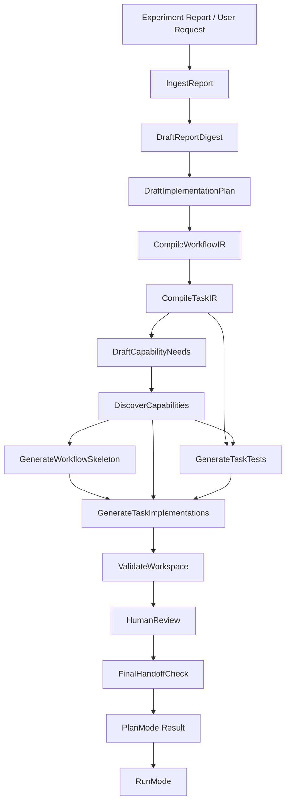

# Plan Mode Architecture

PlanMode turns an experimental report or natural-language scientific
request into a reviewable, Python-native molexp workspace. It authors
and validates a workspace; it does not execute experiments.

PlanMode is implemented as a `molexp.workflow.Workflow`. The agent
layer owns the prompts, model policy, review gate, and handoff contract.
The workflow layer owns workflow/task abstractions and generic
`WorkflowContract` validation. The workspace layer owns generic storage
primitives such as subsystem directories and atomic writes.

## Flow



## Planning Nodes

The current PlanMode workflow uses these 13 node names:

- `IngestReport`
- `DraftReportDigest`
- `DraftImplementationPlan`
- `CompileWorkflowIR`
- `CompileTaskIR`
- `DraftCapabilityNeeds`
- `DiscoverCapabilities`
- `GenerateWorkflowSkeleton`
- `GenerateTaskTests`
- `GenerateTaskImplementations`
- `ValidateWorkspace`
- `HumanReview`
- `FinalHandoffCheck`

The two capability nodes (Phase 4-5 of `agent-pydanticai-rectification`)
sit between IR compilation and the codegen fan-out so each codegen
node can refuse unevidenced Molcrafts API references. See
[`agent.md`](agent.md#capability-discovery-gate) for the full gate
contract.

Code, tests, and documentation should use these names for the current
pipeline.

## Artifacts

PlanMode materializes a plan workspace under the agent-owned subsystem
store:

```text
<workspace>/.subsystems/agent.plan-experiments/<plan_id>/
```

The workspace contains:

- `report/original.md`
- `report/digest.md`
- `plan/implementation_plan.md`
- `ir/workflow.yaml`
- `ir/tasks/*.yaml`
- `capability/needs.yaml`
- `capability/evidence.yaml`
- `capability/missing.md`
- `src/experiment/workflow.py`
- `src/experiment/tasks/*.py`
- `tests/test_*.py`
- `manifest.yaml`
- `validation_report.md`
- `validation_report.yaml`

Generated experiment code is Python-native and uses
`molexp.workflow.WorkflowCompiler`. The generated workflow module exposes
`create_workflow`, which returns the compiled
`molexp.workflow.CompiledWorkflow` object that RunMode will load.

## Validation

Validation has two levels:

- `ValidateWorkspace` checks materialized files, task IR files, generated
  source, RunMode-style entrypoint importability, and delegates generic
  workflow contract rules to `molexp.workflow.validate_workflow_contract`.
- `FinalHandoffCheck` repeats the RunMode-facing import and contract
  validation after human review so final edits cannot bypass handoff
  checks.

Syntax compilation is only a preliminary check. A workspace is runnable
only if RunMode can import the generated entrypoint and the loaded
workflow passes generic contract validation.

## Review And Readiness

Human approval and runnable readiness are separate:

```text
human approval of the plan
machine validation of the handoff
ready_for_run status
```

Default auto-approval may approve the design direction, but failed
machine validation cannot produce `ready_for_run`. The manifest records
both the approval result and the final machine-readable status under the
`plan_mode` block.

Current status values are:

- `draft`
- `validated`
- `validation_failed`
- `ready_for_review`
- `approved`
- `approved_with_override`
- `ready_for_run`
- `pending_review`

## Handoff

PlanMode ends with a `PlanRunHandoff`. The manifest includes the
entrypoint metadata RunMode needs:

```yaml
plan_mode:
  status: ready_for_run
  validation_passed: true
  ready_for_run: true
  handoff:
    source_root: src
    module: experiment.workflow
    symbol: create_workflow
  override: false
```

RunMode owns dispatch, monitoring, resume, logging, backend execution,
failure tracking, and artifact collection. It should not have to
rediscover basic PlanMode generation errors.
