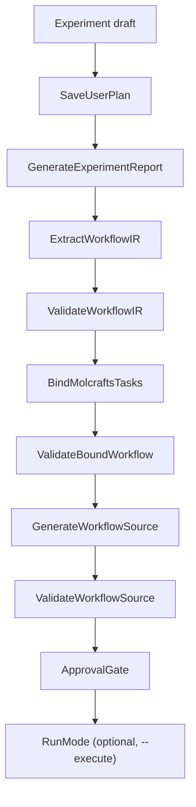
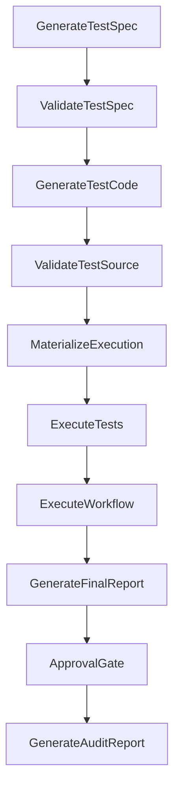

# Plan Mode Architecture

PlanMode turns a natural-language experiment draft into validated,
Python-native `molexp.workflow` source. It authors and validates; it
does not run the experiment. RunMode is its sibling: it generates and
runs tests, executes the workflow, and produces a final report. Both
are **`Mode` pipelines in `molexp.harness`** — the top layer of the
dependency DAG.

> PlanMode and RunMode used to be `molexp.agent` modes built on
> `molexp.workflow`. They now live in the harness as ordered lists of
> `Stage` objects. The harness reaches the LLM only through the agent's
> `Router` Protocol (`RouterBackedAgentGateway`), and it never loads the
> workflow engine in-process — pytest and the materialized workflow
> driver run as executor subprocesses.

## A Mode is a stage ledger

A `Mode` is an ordered list of `Stage`s run against one
content-addressed `Run`. `Mode.stages(user_input)` returns the
sequence; the runner executes each `Stage.run(ctx) -> ArtifactRef`,
brackets it with `stage_started` / `artifact_created` / `stage_completed`
events, and auto-wires `derived_from` lineage between artifacts. Each
completed stage is recorded in a ledger keyed by the Run's fingerprint,
so re-running the **same draft** resumes on the same Run and skips
already-completed stages.

Run-level provenance (params, config hash, code/script identity) is
owned by **workspace** (`RunMetadata` / `AssetCatalog`). Harness lineage
covers only the agent-pipeline artifacts and stamps each edge with its
stage plus the workspace `run_id`.

## PlanMode flow (9 stages)



- `SaveUserPlan`, `GenerateExperimentReport` — capture the request and
  draft an experiment report.
- `ExtractWorkflowIR` / `ValidateWorkflowIR` — lift the report into a
  workflow IR and check it structurally.
- `BindMolcraftsTasks` / `ValidateBoundWorkflow` — bind IR nodes to
  concrete tasks and re-validate the bound graph.
- `GenerateWorkflowSource` / `ValidateWorkflowSource` — emit
  `molexp.workflow` Python source and validate it.
- `ApprovalGate` — human (or auto-grant) approval before any execution.

## RunMode flow (10 stages)

RunMode consumes PlanMode's artifacts on the **same Run**.
`RunMode(executor=…)` defaults to `LocalExecutor`; inject
`DryRunExecutor` for a dry run.



Generated tests **gate execution**: red tests block `ExecuteWorkflow`.
Both `ExecuteTests` (pytest) and `ExecuteWorkflow` (the materialized
`run_workflow.py` driver) run as **executor subprocesses**, so the
`molexp.workflow` engine never loads inside the harness process.

## Validation

Validators under `harness/validators/` are pure, synchronous, and
deterministic. They return a `ValidationReport` and **never raise** —
the owning stage decides whether a report's violations should lift to a
`StageExecutionError`. Each `Validate*` stage pairs with its `Generate*`
predecessor (`ValidateWorkflowIR`, `ValidateBoundWorkflow`,
`ValidateWorkflowSource`, `ValidateTestSpec`, `ValidateTestSource`).

## Artifacts and stores

PlanMode and RunMode write under the Run directory:

```text
runs/<run_id>/
├── artifacts/        # stage outputs (reports, IR, generated source, tests, …)
└── harness.sqlite    # event log + artifact lineage (SQLite-backed)
```

`FileArtifactStore` holds the artifact blobs; `SQLiteEventLog` and
`SQLiteArtifactLineageStore` share the run-local `harness.sqlite` and
enforce `UNIQUE(run_id, seq)`. The audit report (`GenerateAuditReport`)
and `replay_metadata` reconstruct the pipeline from those records.

## Production entry point

```bash
# Plan only — generate + validate workflow source, stop at the gate
molexp plan "screen solvent conditions for electrolyte X"

# Plan, then chain RunMode on the same Run
molexp plan -f draft.md --execute
```

`molexp plan` (`cli/plan_cmd.py`) injects the agent gateway and the
executor, derives a content-addressed Run from the draft, and drives
PlanMode (and, with `--execute`, RunMode). Because the Run is
content-addressed, re-issuing the same draft resumes the stage ledger
rather than starting over. The model defaults to the operator's
`agent.model` config (`~/.molexp/config.json`).
