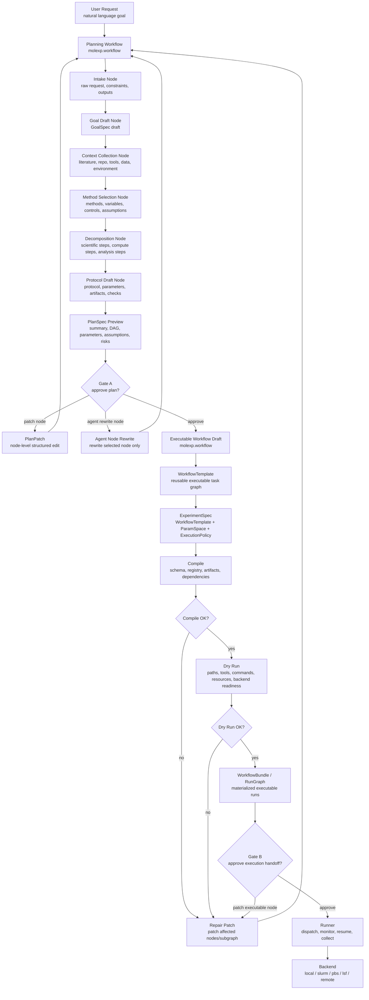

# Plan Mode Architecture

Plan mode is a workflow authoring and validation system. It does not execute
experiments.

The planning workflow is represented with `molexp.workflow`. It turns a natural
language request into a structured `PlanSpec`, supports node-level patches and
agent rewrites, compiles the executable portion into workflow artifacts, runs a
dry run, and produces a handoff bundle for the runner.

## Flow

## Planning Nodes

The planning workflow uses these documented node names:

- `IntakeNode`
- `GoalDraftNode`
- `ContextCollectionNode`
- `MethodSelectionNode`
- `DecompositionNode`
- `ProtocolDraftNode`
- `PreviewNode`
- `ApprovalNode`
- `RevisionNode`
- `ExecutableWorkflowDraftNode`
- `CompileNode`
- `DryRunNode`
- `HandoffNode`

Code and documentation must use the same node names.

## Artifacts

Plan mode produces and revises these artifacts:

- `PlanSpec`
- `PlanPreview`
- `PlanPatch`
- `ExecutableWorkflowDraft`
- `WorkflowTemplate`
- `ExperimentSpec`
- `CompileReport`
- `DryRunReport`
- `WorkflowBundle` / `RunGraph`
- handoff bundle

`PlanSpec` is user-facing and editable. It is not the executable workflow.

## Revision

Plan rejection creates a structured `PlanPatch` by default. The patch targets a
specific node or field and can add, remove, replace, update, rewrite, disable,
or enable a node.

Agent rewrite is node-scoped. The agent rewrites the selected node, validates
the node output against the node schema, marks affected downstream nodes stale,
and regenerates only the affected preview or subgraph when possible.

Full replanning is an explicit fallback, not the default revision behavior.

## Handoff

Plan mode ends at an approved handoff bundle. It must not call
`Workflow.execute()` directly.

The runner receives the handoff bundle and owns dispatch, monitoring, resume,
logging, failure tracking, backend execution, and artifact collection.
