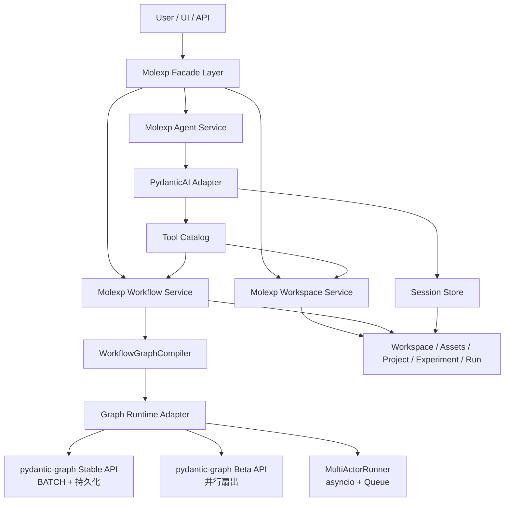

# Molexp 接入 `PydanticAI` 并以 `pydantic-graph` 重构 Workflow 的设计提案

> 状态：设计提案 v3
> 目标：将 `molexp` 演进为"完整工作流与资产管理平台 + 自主驱动系统"。
> 关键决策：
> - `workspace` 必须保留，并继续作为系统真相源
> - 全量引入 `PydanticAI` 承载 `molexp.agent`
> - 以封装方式引入 `pydantic-graph` 替换 workflow kernel
> - **彻底重构，不向后兼容**，项目仍处于高速开发期，不保留任何兼容 shim
> - 用户不直接操作第三方库，所有能力通过 `molexp` 自身 facade 暴露

---

## 1. 提案摘要

本提案建议把 `molexp` 重构为三层架构：

```
Molexp Product Layer
  = Workspace + Assets + Project/Experiment/Run + UI/API

Molexp Agent Layer
  = Goal / Session / Planner / Tooling / Approval / Replan
  = built on top of PydanticAI

Molexp Workflow Layer
  = WorkflowSpec / WorkflowRuntime / GraphExecution
  = built on top of pydantic-graph
```

核心思想：

- `PydanticAI` 负责智能控制层（agent、tool、session、replanning）
- `pydantic-graph` 负责 workflow runtime（DAG 编排、步骤执行、持久化）
- `molexp` 继续负责产品语义、workspace、asset、experiment/run、用户 API、可观测性和持久化

最终用户使用体验：

- **显式 workflow 模式**：用户声明步骤和依赖，系统编译执行（支持函数式和 OOP 两种写法）
- **agent 模式**：用户给一个目标，系统自动规划、调用工具、产生观测、重规划
- 两种模式共享 workspace / run / assets

所有底层实现细节（`pydantic_ai.Agent`、`pydantic_graph.Graph`、`BaseNode`）完全封装在 `molexp` 内部，不暴露给用户。

---

## 2. pydantic-graph 技术调研结论

### 2.1 Stable API（原始 API）

**节点定义**：节点是实现 `BaseNode[StateT, DepsT, RunEndT]` 的 dataclass，`run()` 方法始终是 async，返回类型注解决定出边：

```python
@dataclass
class MyNode(BaseNode[StateT, DepsT, RunEndT]):
    input_value: int

    async def run(self, ctx: GraphRunContext[StateT]) -> NextNode | End[int]:
        ctx.state.counter += 1
        if done:
            return End(self.input_value)
        return NextNode(self.input_value + 1)
```

**共享状态**：`GraphRunContext.state` 是一个 dataclass，所有节点共享并可就地修改。数据流通过节点 dataclass 字段（构造时传入）或共享 state 传递。

**循环（Actor 模式基础）**：节点可以在返回类型中包含自身，形成循环：

```python
@dataclass
class ActorNode(BaseNode[StateT]):
    async def run(self, ctx: GraphRunContext[StateT]) -> ActorNode | End[None]:
        msg = ctx.state.inbox.get_nowait()
        result = process(msg)
        ctx.state.outbox.put_nowait(result)
        return ActorNode()  # 回到自身，持续运行
```

**持久化（内建）**：Stable API 有完整的 `BaseStatePersistence` 接口：

| 内建实现 | 存储 | 说明 |
|----------|------|------|
| `SimpleStatePersistence` | 内存，仅最新 | 默认 |
| `FullStatePersistence` | 内存列表 | 支持 `dump_json()` / `load_json()` |
| `FileStatePersistence` | JSON 文件 | 文件锁，适合单 run 恢复 |

快照结构（`NodeSnapshot`）包含：执行前完整 state、节点实例、时间戳、状态（created/pending/running/success/error）。可通过 `graph.initialize()` + `graph.iter_from_persistence()` 实现跨进程恢复。

**关键限制**：**Stable API 不支持并行节点执行**（GitHub issue #704 open）。所有节点严格串行推进。

### 2.2 Beta API

Beta API 引入构建器模式和真正的并行能力。数据流模型（`StepContext.inputs` 携带类型化输入）与当前 `Link.mapping` 的语义更接近：

```python
g = GraphBuilder(state_type=MyState, input_type=list[int], output_type=list[int])

@g.step
async def process_item(ctx: StepContext[MyState, None, int]) -> int:
    return ctx.inputs * 2  # 类型化的上游输入

collect = g.join(reduce_list_append, initial_factory=list[int])

g.add(
    g.edge_from(g.start_node).map().to(process_item),  # 并行扇出
    g.edge_from(process_item).to(collect),
    g.edge_from(collect).to(g.end_node),
)
```

**Beta API 关键限制**：**没有内建持久化**。官方明确说明原因是并行执行时一致性快照的复杂性。官方建议配合 Temporal / DBOS / Prefect 做持久化。

### 2.3 多 Actor 并发的技术结论

pydantic-graph 的并发支持现状：

| 场景 | Stable API | Beta API |
|------|-----------|----------|
| 单 Actor 循环 | 支持（节点返回自身） | 支持（`@g.stream` 或循环） |
| 并行扇出（一对多） | 不支持 | 支持（`.map()` + `.join()`） |
| 多 Actor pipeline（A→B→C） | 不支持并发 | 不支持（无内建 pipeline 模式） |
| 多 Actor 双向通信 | 不支持 | 不支持 |

**缓解策略**：多 Actor pipeline 场景，adapter 层在 pydantic-graph 之外用 asyncio 并发运行多个 graph 实例，通过 `asyncio.Queue` 传递消息。这把多 Actor 协调责任完全封装在 `molexp.workflow.runtime` 内部，用户侧 API 不感知。

---

## 3. 设计目标

### 3.1 产品目标

- 保留并强化 `workspace / assets / project / experiment / run`
- 让 workflow kernel 不再自研维护
- 让 agent/autonomy 能力成为一等公民
- 用户只面向 `molexp` API，不接触底层第三方库

### 3.2 工程目标

- **彻底重构，不向后兼容**：删除现有 `WorkflowCompiler`、`WorkflowEngine`、`Link`，不保留任何 shim。项目处于高速开发期，技术债务清零优先于迁移平滑。
- 降低自研 workflow runtime 维护成本
- API 风格向 pydantic-graph / PydanticAI 借鉴，同时保留 OOP 类写法（两种风格均一等支持）
- 不让第三方库类型污染 `molexp` 公共 API

### 3.3 非目标

- 不把 `molexp` 变成 `PydanticAI` 的薄皮壳
- 不让用户直接写 `Agent(...)` 或 `Graph(...)`
- 不为旧用户提供迁移脚本或自动升级工具

---

## 4. API 设计哲学

### 4.1 双风格统一支持

molexp 的新 API 借鉴 pydantic-graph 的函数式装饰器风格，同时保留完整的 OOP 类写法。两种风格在运行时等价，用户根据场景和偏好选择，底层统一编译到相同的 pydantic-graph 节点。

#### Workflow Step — 两种写法

**函数式（借鉴 `@g.step`）**：

```python
from molexp.workflow import workflow, StepContext

wf = workflow(name="data-pipeline")

@wf.step(depends_on=["fetch"])
async def validate(ctx: StepContext[DataState, DataDeps, FetchResult]) -> ValidateResult:
    data = ctx.inputs          # 类型化的上游输入（FetchResult）
    ctx.state.validated += 1   # 共享状态
    return ValidateResult(data=cleaned(data))
```

**OOP（保留类继承）**：

```python
from molexp.workflow import Step, StepContext

class ValidateStep(Step[DataState, DataDeps, FetchResult, ValidateResult]):
    config: ValidateConfig     # Pydantic 模型，config-as-state 模式

    async def execute(self, ctx: StepContext[DataState, DataDeps, FetchResult]) -> ValidateResult:
        data = ctx.inputs
        ctx.state.validated += 1
        return ValidateResult(data=cleaned(data, threshold=self.config.threshold))
```

#### Actor — 两种写法

Actor 在底层编译为 pydantic-graph 的循环节点（节点返回自身）。多 Actor pipeline 由 `MultiActorRunner` 以 asyncio 并发调度。

**函数式**：

```python
@wf.actor(depends_on=["ingest"])
async def filter_stream(
    ctx: ActorContext[StreamState, StreamDeps, RawEvent]
) -> AsyncIterator[FilteredEvent]:
    while True:
        msg = await ctx.receive()
        if msg.quality > ctx.state.threshold:
            yield FilteredEvent(msg)
```

**OOP**：

```python
from molexp.workflow import Actor, ActorContext

class FilterActor(Actor[StreamState, StreamDeps, RawEvent, FilteredEvent]):
    config: FilterConfig

    async def run(
        self, ctx: ActorContext[StreamState, StreamDeps, RawEvent]
    ) -> AsyncIterator[FilteredEvent]:
        while True:
            msg = await ctx.receive()
            if msg.quality > self.config.threshold:
                yield FilteredEvent(msg)
```

#### Agent Tool — 两种写法

**函数式（借鉴 `@agent.tool`）**：

```python
from molexp.agent import agent_tool, ToolContext

@agent_tool(level="workspace", requires_approval=False)
async def read_asset(ctx: ToolContext, asset_name: str) -> AssetContent:
    return ctx.workspace.assets.read(asset_name)
```

**OOP**：

```python
from molexp.agent import Tool, ToolContext

class ReadAssetTool(Tool):
    name = "workspace.read_asset"
    level = "workspace"
    requires_approval = False

    async def call(self, ctx: ToolContext, asset_name: str) -> AssetContent:
        return ctx.workspace.assets.read(asset_name)
```

### 4.2 核心上下文类型

借鉴 pydantic-graph 的 `StepContext[StateT, DepsT, InputT]` 设计，molexp 暴露三个统一的上下文类型：

```python
# Workflow Step 上下文（对应 pydantic-graph StepContext）
class StepContext(Generic[StateT, DepsT, InputT]):
    state: StateT       # 共享可变状态
    deps: DepsT         # 注入的依赖（workspace、run、外部服务）
    inputs: InputT      # 类型化的上游输入

# Actor 上下文（扩展 StepContext，增加消息收发）
class ActorContext(StepContext[StateT, DepsT, InputT]):
    async def receive(self) -> InputT: ...
    async def send(self, output: OutputT) -> None: ...

# Agent Tool 上下文
class ToolContext:
    workspace: Workspace
    run: Run | None
    session: AgentSession
```

### 4.3 与 pydantic-graph 的风格对照

| 概念 | pydantic-graph 原始 | molexp 对应 |
|------|---------------------|-------------|
| 节点定义 | `@dataclass class Foo(BaseNode)` | `@wf.step` / `class FooStep(Step)` |
| 上下文 | `GraphRunContext[StateT]` | `StepContext[StateT, DepsT, InputT]` |
| 输入数据 | 节点 dataclass 字段 | `ctx.inputs`（类型化） |
| 共享状态 | `ctx.state` | `ctx.state`（同） |
| 终止 | `End(data)` | `WorkflowResult`（内部封装） |
| 持久化 | `BaseStatePersistence` | `RunStorePersistence`（实现该接口） |
| 并行扇出 | `.map()` + `.join()` | `parallel_map()` + `join()` |

---

## 5. 用户侧用例

### 5.1 Workspace 层用例

**用例 1：初始化工作区并组织项目**

```python
from molexp.workspace import Workspace

ws = Workspace.from_env()

project = ws.create_project(
    name="Polymer Stability Study",
    description="GNN-based stability prediction for polymer chains",
)

experiment = project.create_experiment(
    name="Baseline GNN",
    workflow_source="workflows/train_gnn.py",
    tags=["baseline", "gnn"],
)
```

**用例 2：创建 Run 并记录资产与指标**

```python
run = experiment.create_run(
    parameters={"lr": 1e-3, "hidden_dim": 128, "epochs": 100},
)

with run.start() as ctx:
    ctx.log("Training started")
    ctx.assets.register("training_data", path="/data/polymer_train.h5")

    model, metrics = train(ctx.parameters)

    ctx.log_metrics({"val_loss": metrics.val_loss, "mae": metrics.mae})
    ctx.assets.create("checkpoint", model.save("/tmp/model.pt"))
    ctx.assets.create("predictions", "/tmp/predictions.csv")
```

**用例 3：比较多个 Run**

```python
runs = experiment.list_runs()
comparison = experiment.compare_runs(
    run_ids=[r.run_id for r in runs],
    metrics=["val_loss", "mae"],
    parameters=["lr", "hidden_dim"],
)
comparison.to_dataframe().sort_values("val_loss")
```

**用例 4：层级资产库**

```python
ws.assets.create("bert_pretrained", "/models/bert-base.pt")        # 全局
project.assets.create("polymer_dataset", "/data/qm9.tar.bz2")     # 项目内
experiment.assets.create("mol_features", "/data/features.h5")     # 实验内
run.assets.create("run_output", "/outputs/results.json")           # 单次执行

# 向上查找：run → experiment → project → workspace
asset = run.assets.resolve("bert_pretrained")
```

---

### 5.2 Workflow 层用例

**用例 1：函数式风格定义线性 workflow**

```python
from molexp.workflow import workflow, StepContext
from molexp.workspace import DataState, DataDeps

wf = workflow(name="data-pipeline")

@wf.step
async def fetch(ctx: StepContext[DataState, DataDeps, None]) -> FetchResult:
    return FetchResult(data=ctx.deps.storage.read(ctx.state.source))

@wf.step(depends_on=["fetch"])
async def validate(ctx: StepContext[DataState, DataDeps, FetchResult]) -> ValidateResult:
    ctx.state.row_count = len(ctx.inputs.data)
    return ValidateResult(data=clean(ctx.inputs.data))

@wf.step(depends_on=["validate"])
async def publish(ctx: StepContext[DataState, DataDeps, ValidateResult]) -> PublishResult:
    path = ctx.deps.storage.write(ctx.inputs.data)
    ctx.run.assets.create("cleaned_dataset", path)
    return PublishResult(asset_id="cleaned_dataset")

run = experiment.create_run(parameters={"source": "s3://bucket/raw"})
result = await wf.execute(run=run)
print(result.outputs["publish"].asset_id)
```

**用例 2：OOP 风格定义 workflow（可复用、可配置）**

```python
from molexp.workflow import Step, StepContext, WorkflowBuilder

class FetchStep(Step[DataState, DataDeps, None, FetchResult]):
    config: FetchConfig

    async def execute(self, ctx: StepContext[DataState, DataDeps, None]) -> FetchResult:
        return FetchResult(data=ctx.deps.storage.read(self.config.source))

class ValidateStep(Step[DataState, DataDeps, FetchResult, ValidateResult]):
    config: ValidateConfig

    async def execute(self, ctx: StepContext[DataState, DataDeps, FetchResult]) -> ValidateResult:
        ctx.state.row_count = len(ctx.inputs.data)
        return ValidateResult(data=clean(ctx.inputs.data, schema=self.config.schema))

# 组装 workflow（与函数式等价，底层同一套编译路径）
wf = (
    WorkflowBuilder(name="data-pipeline")
    .add(FetchStep(config=FetchConfig(source="s3://bucket/raw")))
    .add(ValidateStep(config=ValidateConfig(schema="polymer_v2")), depends_on=["fetch"])
    .build()
)

result = await wf.execute(run=run)
```

**用例 3：并行扇出（Map / Reduce）**

```python
from molexp.workflow import workflow, StepContext, parallel_map, join

wf = workflow(name="grid-search")

@wf.step
async def prepare(ctx: StepContext[SearchState, None, None]) -> PrepareResult:
    return PrepareResult(grid=ctx.state.parameter_grid)

@parallel_map(wf, fan_out_over="grid", depends_on=["prepare"])
async def train_variant(ctx: StepContext[SearchState, None, GridPoint]) -> TrainResult:
    # 每个 GridPoint 并发执行，底层用 pydantic-graph beta API .map()
    model = train(lr=ctx.inputs.lr, hidden=ctx.inputs.hidden)
    return TrainResult(val_loss=model.val_loss, config=ctx.inputs)

@join(wf, reducer="best_by_val_loss", depends_on=["train_variant"])
async def select_best(ctx: StepContext[SearchState, None, list[TrainResult]]) -> BestResult:
    return min(ctx.inputs, key=lambda r: r.val_loss)

run = experiment.create_run(parameters={
    "parameter_grid": [
        {"lr": 1e-3, "hidden": 64},
        {"lr": 1e-4, "hidden": 128},
        {"lr": 5e-4, "hidden": 256},
    ]
})
result = await wf.execute(run=run)
print(result.outputs["select_best"].config)
```

**用例 4：Workflow 暂停与恢复**

```python
# 启动，中途进程崩溃
execution = await wf.start(run=run)
print(execution.execution_id)   # "exec-abc123"

# 重启后恢复（从 Run store 加载最后快照）
execution = await wf.resume(run=run, execution_id="exec-abc123")
result = await execution.wait()
print(result.status)  # "completed"
```

**用例 5：流式 Actor Workflow**

```python
from molexp.workflow import workflow, Actor, ActorContext

wf = workflow(name="streaming-pipeline", mode="streaming")

class KafkaIngest(Actor[StreamState, StreamDeps, None, RawEvent]):
    config: KafkaConfig

    async def run(self, ctx: ActorContext[StreamState, StreamDeps, None]) -> AsyncIterator[RawEvent]:
        async for msg in ctx.deps.kafka.consume(self.config.topic):
            yield RawEvent(msg)

@wf.actor(depends_on=["ingest"])
async def quality_filter(ctx: ActorContext[StreamState, StreamDeps, RawEvent]) -> AsyncIterator[CleanEvent]:
    while True:
        msg = await ctx.receive()
        if msg.quality > ctx.state.threshold:
            yield CleanEvent(msg)

wf.add(KafkaIngest(config=KafkaConfig(topic="mol-events")), name="ingest")

run = experiment.create_run(parameters={"threshold": 0.8})
async with wf.stream(run=run) as stream:
    async for event in stream:
        print(event)
```

**用例 6：步进执行（调试）**

```python
async with wf.iter(run=run) as graph_run:
    async for step_event in graph_run:
        print(f"[{step_event.step_name}] {step_event.status}")
        if step_event.step_name == "validate" and step_event.status == "failed":
            print("State at failure:", step_event.state)
            break
```

---

### 5.3 Agent 层用例

**用例 1：目标驱动的自主实验**

```python
from molexp.agent import Goal, AgentService

goal = Goal(
    description="Prepare a validated polymer dataset and run a GNN baseline",
    constraints={"project": "polymer-study", "max_runs": 3},
    success_criteria=[
        "dataset validated and published as experiment asset",
        "at least one training run completed with val_loss < 0.05",
    ],
)

service = AgentService.from_workspace("./lab")
session = await service.run(goal)

print(session.status)           # "completed"
print(session.produced_runs)    # [Run(...), Run(...)]
print(session.artifacts)        # [Asset("dataset"), Asset("checkpoint")]
```

**用例 2：监控 Session 时间线**

```python
session = await service.start(goal)

async for event in session.stream_events():
    match event:
        case PlanCreatedEvent():
            print("Plan:", event.plan_steps)
        case ToolCallEvent():
            print(f"→ {event.tool_name}({event.args})")
        case WorkflowStartedEvent():
            print(f"  workflow run: {event.run_id}")
        case ObservationEvent():
            print(f"  observation: {event.content}")
        case ReplanEvent():
            print(f"  replanning: {event.reason}")
        case SessionCompletedEvent():
            print(f"Done: {event.summary}")
            break
```

**用例 3：函数式注册自定义 Tool**

```python
from molexp.agent import agent_tool, ToolContext

# 用户可以用装饰器给 agent 注册自定义 tool
@agent_tool(level="product", requires_approval=True)
async def run_bayesian_step(
    ctx: ToolContext, experiment_id: str, iteration: int
) -> BayesianStepResult:
    experiment = ctx.workspace.get_experiment(experiment_id)
    run = experiment.create_run(parameters=suggest_next(iteration))
    result = await training_workflow.execute(run=run)
    return BayesianStepResult(val_loss=result.outputs["train"].val_loss, run_id=run.run_id)

service = AgentService.from_workspace("./lab", extra_tools=[run_bayesian_step])
session = await service.run(goal)
```

**用例 4：OOP 风格注册 Tool**

```python
from molexp.agent import Tool, ToolContext

class RunBayesianStep(Tool):
    name = "product.run_bayesian_step"
    level = "product"
    requires_approval = True

    async def call(
        self, ctx: ToolContext, experiment_id: str, iteration: int
    ) -> BayesianStepResult:
        experiment = ctx.workspace.get_experiment(experiment_id)
        run = experiment.create_run(parameters=suggest_next(iteration))
        result = await training_workflow.execute(run=run)
        return BayesianStepResult(val_loss=result.outputs["train"].val_loss, run_id=run.run_id)

service = AgentService.from_workspace("./lab", extra_tools=[RunBayesianStep()])
```

**用例 5：Human-in-the-loop 审批**

```python
from molexp.agent import ApprovalPolicy

policy = ApprovalPolicy(
    require_approval_for=["product.*", "workflow.execute"],
    auto_approve=["workspace.read_*", "workflow.inspect"],
)

service = AgentService.from_workspace("./lab", approval_policy=policy)
session = await service.start(goal)

async for event in session.stream_events():
    if isinstance(event, ApprovalRequestEvent):
        print(f"Approval needed: {event.tool_name}({event.args})")
        decision = input("Approve? [y/n]: ")
        await session.respond_approval(event.request_id, approved=(decision == "y"))
```

**用例 6：Session 恢复与重放**

```python
# 进程重启后恢复
session = await service.resume(session_id="sess-xyz789")
async for event in session.stream_events(): ...

# 事后重放时间线
history = await service.get_session_history("sess-xyz789")
for entry in history.timeline:
    print(f"[{entry.ts}] {entry.event_type}: {entry.summary}")
```

---

## 6. 内部架构

### 6.1 分层结构



### 6.2 Workflow 编译路径

```
WorkflowSpec（用户定义，函数式 or OOP）
  ↓ WorkflowGraphCompiler
  ├─ 纯 BATCH DAG         → pydantic-graph Stable API + RunStorePersistence
  ├─ 含并行扇出           → pydantic-graph Beta API + 手动快照
  └─ 含 Actor（streaming）→ MultiActorRunner（asyncio 并发）
  ↓
WorkflowExecution / WorkflowResult
  → 写入 Run store（真相源）
```

### 6.3 持久化适配

对 Stable API，实现 `RunStorePersistence(BaseStatePersistence)` 将每个 `NodeSnapshot` 原子写入 `Run` store：

```python
class RunStorePersistence(BaseStatePersistence[StateT, RunEndT]):
    def __init__(self, run: Run): ...

    async def snapshot_node(self, snapshot: NodeSnapshot) -> None:
        # 原子写入 run.store/execution/{snapshot.id}.json
        ...

    async def load_next(self) -> NodeSnapshot | None:
        # 读取 status='created' 的最早快照
        ...
```

对 Beta API（无内建持久化），adapter 监听 step 完成事件，主动快照 state 到 Run store，格式与 Stable API 一致。

### 6.4 多 Actor Pipeline 封装

```python
class MultiActorRunner:
    """在 pydantic-graph 之外协调多个并发 Actor graph 实例。"""

    def __init__(self, actor_specs: list[ActorStepSpec], run: Run):
        self._graphs: dict[str, Graph] = {}
        self._channels: dict[tuple[str, str], asyncio.Queue] = {}

    async def start(self) -> None:
        # 1. 为每条 actor link 分配 asyncio.Queue，注入各 GraphState
        # 2. asyncio.gather 并发启动所有 graph 实例
        # 3. 异常传播：任一 actor 失败 → 取消其余，写 run.status=failed
        ...
```

`WorkflowSpec(mode="streaming")` 经 compiler 自动路由到 `MultiActorRunner`，用户不感知。

### 6.5 Agent Tool 分层

```
Level 1: Workspace tools（只读，无需审批）
  workspace.list_projects / list_experiments / list_assets / read_asset / get_run_metrics

Level 2: Workflow tools（执行类，高风险需审批）
  workflow.execute / resume / inspect / fetch_outputs / cancel

Level 3: Product tools（写操作，部分需审批）
  experiment.create_run / run.read_logs / run.publish_artifact / run.compare_results
```

内部全部映射到 `PydanticAI Toolset`，用户只见 `molexp` tool 名称。

### 6.6 PydanticAI 事件映射

| PydanticAI 内部事件 | Molexp 事件 |
|---------------------|-------------|
| Agent 开始规划 | `PlanCreatedEvent(plan_steps)` |
| `FunctionToolCallEvent` | `ToolCallEvent(tool_name, args)` |
| `FunctionToolResultEvent` | `ToolResultEvent(tool_name, result)` |
| Agent 检测到失败，重规划 | `ReplanEvent(reason, new_plan)` |
| `ApprovalRequiredToolset` 拦截 | `ApprovalRequestEvent(request_id, tool_name, args)` |
| Agent `End` | `SessionCompletedEvent(summary, artifacts)` |

---

## 7. 彻底重构说明

**删除的模块**：

| 模块 | 替代 |
|------|------|
| `molexp.workflow.compiler.core` | `molexp.workflow.compiler.WorkflowGraphCompiler` |
| `molexp.workflow.engine.engine` | `molexp.workflow.runtime.pydantic_graph` |
| `molexp.workflow.task.Task` / `Actor` | `molexp.workflow.Step` / `Actor`（新 API） |
| `molexp.workflow.workflow.Workflow` | `molexp.workflow.WorkflowSpec` |
| `molexp.workflow.workflow.Link` | `StepContext.inputs` + `input_mapping` |

**无向后兼容**：

- 不保留旧 `Task`、`Link`、`WorkflowCompiler`、`WorkflowEngine` 的 import path
- 不提供 shim 或 deprecation warning
- 现有代码需按新 API 完整重写
- 测试套件同步重写（旧测试直接删除，按新 API 重新覆盖）

---

## 8. 实施计划

### Phase 1：彻底删除旧 kernel，定义新接口

**目标**：清空自研 workflow runtime，定义新公共接口和内部 adapter contract。

工作项：

- **删除**：`workflow/compiler/`、`workflow/engine/`、旧 `workflow/task.py`、旧 `workflow/workflow.py`
- 定义 `molexp.workflow` 新公共接口（`WorkflowSpec`、`Step`、`Actor`、`StepContext`、`ActorContext`、`workflow()` 装饰器、`WorkflowBuilder`）
- 定义 `molexp.agent` 新公共接口（`Goal`、`AgentSession`、`AgentService`、`Tool`、`agent_tool`、`ApprovalPolicy`）
- 定义内部 adapter interface（`WorkflowRuntime`、`AgentRuntime`、`ToolCatalogAdapter`、`RunStorePersistence`）
- 按新接口重写 contract 测试（不测实现，只测接口行为）

交付：新 API 类型定义冻结，旧 workflow 代码全部清除，新接口有 contract 测试。

### Phase 2：接入 `PydanticAI`（Agent 层）

**目标**：全量引入 agent/tool/session 层，不依赖 Phase 3 完成。

工作项：

- 实现 `PydanticAIAdapter`（封装 `pydantic_ai.Agent`）
- 实现 `MolexpToolCatalog`（三层 tool → `PydanticAI Toolset`）
- 接入 session event stream（PydanticAI 事件 → molexp 事件）
- `ApprovalPolicy` + `ApprovalRequiredToolset` 集成
- Session 持久化写入 workspace（`workspace/sessions/{session_id}/`）
- UI：Session detail、Tool call timeline、Approval panel

交付：`Goal → AgentSession → Tool Calls → Observations` 完整闭环，UI 可展示 session timeline。

### Phase 3：用 `pydantic-graph` 实现 workflow runtime

**目标**：实现新接口背后的 graph-backed runtime。

工作项：

- 实现 `WorkflowGraphCompiler`（`WorkflowSpec` → pydantic-graph 节点，支持函数式和 OOP 两种定义方式）
- 实现 `RunStorePersistence`（`BaseStatePersistence` → Run store）
- 实现 `GraphWorkflowRuntime`（Stable API 路径 + Beta API 路径）
- 实现 `MultiActorRunner`（asyncio 并发 + 多 graph 实例）
- UI：Workflow graph 可视化（pydantic-graph mermaid 输出）

交付：`molexp.workflow` 新 API 完整可用，现有 workspace 测试全部通过。

### Phase 4：产品化

**目标**：Workflow + Agent 联合可视化，完整自主驱动体验。

工作项：

- Goal input UI
- Session + Workflow runs 联合视图
- Replanning 可视化
- Human-in-the-loop approval flow
- Session replay
- Multi-session scheduling

---

## 9. 团队分工

假设 8 人小组，角色分为三类：**产品与协调**、**工程**、**质量保障**。三条工程主线（Workspace、Workflow、Agent）并行推进，PM 和 QA 横切全程。

### 角色总览

| 角色 | 人数 | 主要职责 |
|------|------|---------|
| PM / Tech Lead | 1 | 产品目标、API 设计决策、跨成员协调、验收 |
| QA Engineer | 1 | 测试策略、质量门控、集成测试、CI/CD |
| Core & Workspace | 1 | 共享基础类型、workspace 稳定 |
| Workflow API | 1 | 公共 workflow DSL（函数式 + OOP） |
| Workflow Runtime | 1 | pydantic-graph adapter、MultiActorRunner |
| Agent | 1 | PydanticAI 接入、session、tool |
| Platform & UI | 2 | FastAPI 路由、React 前端 |

---

### PM / Tech Lead（1 人）

**职责**：

- **产品层**：维护并优先级排序 Phase 1-4 的功能列表；基于用户侧用例定义每个 Phase 的验收标准；决策 API 设计中的取舍（函数式 vs OOP 优先级、哪些能力纳入 MVP）
- **技术协调**：主持每周接口评审会（Interface Review）；负责跨模块 API 冻结决策（尤其是 `StepContext`、`WorkflowRuntime` interface、`ToolContext` 等共享类型）；协调 B/C 之间的接口对齐
- **验收**：每个 Phase 交付前，对照第 5 节"用户侧用例"逐条手工验证；记录 gap 并分派修复
- **外部依赖追踪**：跟踪 pydantic-graph beta API 变更（release notes）；评估何时从 asyncio 多实例方案迁移到 beta 内建 pipeline

**与其他角色的接口**：
- 向 QA 输出每个 Phase 的验收测试场景清单
- 向工程成员输出接口冻结通知（冻结后的变更需评审）
- 接收 QA 的质量报告，决定是否 ready to release

---

### QA Engineer（1 人）

**职责**：

- **测试策略制定**（Phase 1）：定义三层测试金字塔——单元测试（各成员自持）、集成测试（QA 主持）、端到端测试（QA 主持）；制定覆盖率基线（unit ≥ 80%，集成测试覆盖所有跨层 API 路径）
- **质量门控**：在 CI/CD 中配置 Phase 门控——每个 Phase 合并前必须通过全量测试；配置覆盖率检查、类型检查（mypy strict）、linting（ruff）
- **集成测试主持**：负责编写并维护跨层集成测试：
  - `WorkflowSpec → Run store 持久化` 全链路
  - `Goal → AgentSession → Tool Calls → Run 产出` 全链路
  - `Workspace 层级资产解析` 回归套件
  - `MultiActorRunner` 并发安全专项测试（Actor 启动/消息/异常/关闭）
- **端到端测试**：Phase 4 前建立 E2E 套件，覆盖第 5 节全部用户侧用例（含 UI 操作流）
- **缺陷管理**：记录跨模块缺陷，协调 owner 修复；追踪 regression 率

**与其他角色的接口**：
- 接收 PM 输出的验收场景清单 → 转化为可执行测试用例
- 向各工程成员输出单元测试模板和 mock 规范（避免各模块 mock 方式不一致）
- 向 PM 输出每个 Phase 的质量报告（覆盖率、通过率、已知 bug）
- 与成员 A 共同维护 workspace 层回归套件（此层变更最敏感）

---

### 成员 A：Core & Workspace（1 人）

**负责模块**：`molexp.workspace`、`molexp.core`（基础类型、异常、注册表）

**职责**：
- 保持 workspace 层在重构期间稳定可用（是 Workflow 和 Agent 的依赖基础）
- 定义 Phase 1 共享类型：`StepContext`、`ActorContext`、`ToolContext`、`RunStorePersistence` 接口（与 PM 对齐后冻结）
- 实现 `RunStorePersistence`（写入 Run store 的原子逻辑）
- workspace 层单元测试保持绿色；与 QA 共同维护回归套件

**Phase 依赖**：Phase 1 最先启动，其他工程成员阻塞于共享类型定义。

---

### 成员 B：Workflow 公共 API（1 人）

**负责模块**：`molexp.workflow`（公共 API 层）

**职责**：
- 定义 `WorkflowSpec`、`Step`（OOP 基类）、`Actor`（OOP 基类）
- 实现 `workflow()` 装饰器、`WorkflowBuilder`、`parallel_map()`、`join()`、`@wf.actor`
- 定义 `WorkflowExecution`、`WorkflowResult` 类型
- 与成员 C 协作定义 `WorkflowRuntime` adapter interface（经 PM 评审后冻结）
- 负责公共 API 层单元测试；向 QA 提供集成测试所需的 mock runtime

**Phase 依赖**：Phase 1 完成后即可开始，与成员 C 并行。

---

### 成员 C：Workflow Runtime（1 人）

**负责模块**：`molexp.workflow.runtime.pydantic_graph`、`MultiActorRunner`

**职责**：
- 实现 `WorkflowGraphCompiler`（`WorkflowSpec` → pydantic-graph 节点）
- 实现 `GraphWorkflowRuntime`（Stable API + Beta API 双路径）
- 实现 `MultiActorRunner`（asyncio 并发多 Actor pipeline）
- Beta API 手动持久化适配（step 完成事件 → Run store 快照）
- 单元测试覆盖各编译路径；Actor 并发场景交给 QA 做集成测试

**Phase 依赖**：依赖成员 B 定义的 `WorkflowRuntime` interface（冻结后并行开发）。

---

### 成员 D：Agent 层（1 人）

**负责模块**：`molexp.agent`、`molexp.agent.runtime.pydantic_ai`

**职责**：
- 实现 `PydanticAIAdapter`（封装 `pydantic_ai.Agent`）
- 实现 `MolexpToolCatalog`（三层 tool → PydanticAI Toolset）
- `ApprovalPolicy` + `ApprovalRequiredToolset` 集成
- Session event stream 映射（PydanticAI 事件 → molexp 事件）
- Session 持久化写入 workspace
- `@agent_tool` 装饰器 + `Tool` OOP 基类
- 单元测试可用 mock workspace 隔离；端到端 Agent 场景交给 QA

**Phase 依赖**：Phase 2，可与成员 C 完全并行。

---

### 成员 E/F：Platform & UI（2 人）

**负责模块**：`molexp.server`（FastAPI）、`ui/`

**职责分工**：

- **成员 E（Backend Platform）**：FastAPI 路由（`/api/workflow/*`、`/api/agent/*`）；OpenAPI → TypeScript codegen 维护；WebSocket / SSE for session event stream；与 B/C/D 协作接口联调
- **成员 F（Frontend）**：Session detail、Tool call timeline、Approval panel（Phase 2）；Workflow graph 可视化（Phase 3）；Goal input UI、联合视图（Phase 4）

**Phase 依赖**：横切所有 Phase，随其他成员交付逐步推进。

---

### 并行关系与里程碑

```
         Week 1-2          Week 3-6           Week 7-10         Week 11+
         ──────────────────────────────────────────────────────────────
PM:      [接口评审+API冻结决策]─────[Phase验收]──[Phase验收]──[Phase验收]──
QA:      [测试策略+CI配置]──[集成测试套件]───[E2E套件]────────[质量报告]────
A:       [共享类型+Workspace稳定]─────────────────────────────────────────
B:       [Phase 1: Workflow公共API]──[Phase 3: DSL完善]───────────────────
C:                  [Phase 3: Graph Adapter + MultiActorRunner]───────────
D:            [Phase 2: PydanticAI Agent层]──────────────────────────────
E:       [路由skeleton]──[Phase 2: 后端API]──[Phase 3: API扩展]──[Phase 4]
F:       [UI框架]────────[Phase 2: Session UI]─[Phase 3: Graph UI]─[Phase 4]
                                                              ↓
                                                     [Phase 4: 产品化]
```

**关键依赖链**：

1. A 先于所有人完成共享类型冻结（`StepContext`、`RunStorePersistence` 接口）
2. PM 评审 B/C 的 `WorkflowRuntime` interface → 冻结 → C 才能全速推进
3. D 完全独立，与 B/C 并行
4. QA 在 Phase 1 末建好 CI 质量门控，阻断不合格的 Phase 合并

**接口冻结协议**：所有跨模块共享类型（`StepContext`、`WorkflowRuntime`、`ToolContext` 等）需经 PM 主持的 Interface Review 会议冻结；冻结后变更需重新评审，由 PM 决策影响范围。

---

## 10. 风险与缓解

### 10.1 Beta API 无持久化

风险：并行扇出 workflow 无内建快照，进程崩溃后无法恢复。

缓解：adapter 层在每个 step 完成事件后主动写 state 快照到 Run store，用户无感知。

### 10.2 pydantic-graph API 演进

风险：Beta API 仍在演化，接口可能变更。

缓解：所有 pydantic-graph 调用隔离在 `molexp.workflow.runtime.pydantic_graph` 内部，对外只暴露 `molexp` 类型。未来切换只改 adapter 实现。

### 10.3 多 Actor Pipeline 并发安全

风险：`MultiActorRunner` 逻辑复杂，难以调试。

缓解：写专项集成测试，覆盖 Actor 启动、消息传递、异常传播、优雅关闭。Beta API 未来如加入 pipeline 模式，可替换实现而不改用户接口。

### 10.4 彻底删除旧 kernel 的回归风险

风险：删除 `WorkflowCompiler` / `WorkflowEngine` 后，现有高层测试可能大量失败。

缓解：Phase 1 同步删除旧测试，按新 API contract 重写，不试图让旧测试通过新实现。workspace 层测试（不依赖 workflow runtime）保持绿色作为回归防线。

---

## 11. 成功标准

- 用户只使用 `molexp` API，不直接依赖 `pydantic_ai` 或 `pydantic_graph` 类型
- `workspace` 仍然是唯一产品真相源
- Workflow 支持函数式和 OOP 两种风格，底层编译路径统一
- `PydanticAI` 完整承载 `molexp.agent`（goal → session → tools → observations）
- `pydantic-graph` 完整承载 `molexp.workflow` runtime（BATCH + 并行扇出 + Actor 循环）
- workflow run / agent session / assets 能统一出现在同一产品视图中
- workspace / run / asset 测试全部通过
- 用户可以用 5 行代码给一个 goal，得到一个完整的实验结果

---

## 12. 参考资料

- pydantic-graph Overview：https://ai.pydantic.dev/graph/
- pydantic-graph Graph API：https://ai.pydantic.dev/api/pydantic_graph/graph/
- pydantic-graph Persistence API：https://ai.pydantic.dev/api/pydantic_graph/persistence/
- pydantic-graph Beta：https://ai.pydantic.dev/graph/beta/
- pydantic-graph Beta API：https://ai.pydantic.dev/api/pydantic_graph/beta/
- PydanticAI Agents：https://ai.pydantic.dev/agent/
- PydanticAI Toolsets：https://ai.pydantic.dev/toolsets/
- PydanticAI UI Overview：https://ai.pydantic.dev/ui/overview/
- PydanticAI Durable Execution：https://ai.pydantic.dev/durable_execution/overview/
