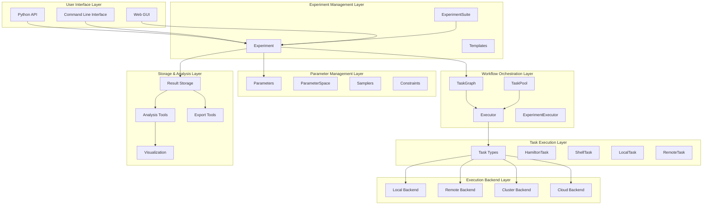
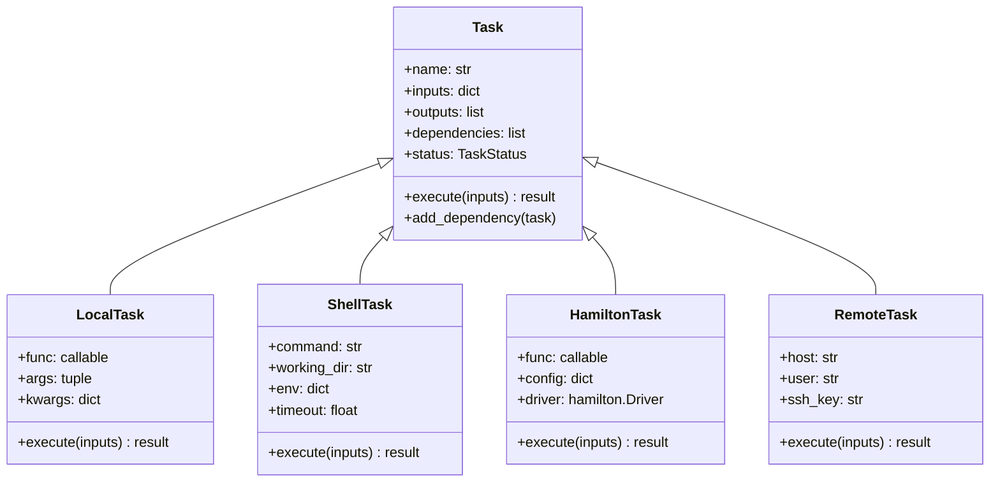
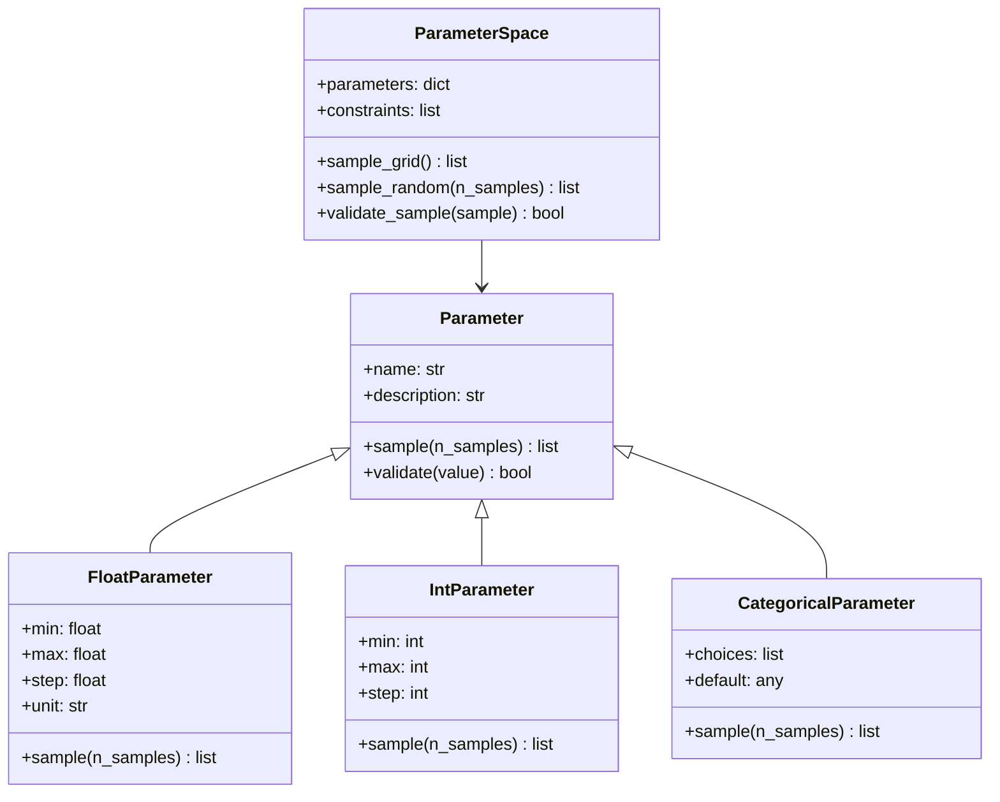
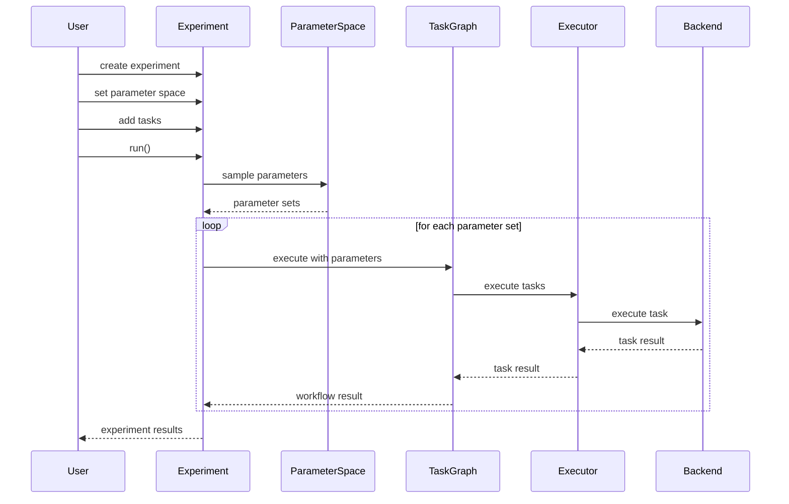

# Architecture

This document describes the overall architecture and design principles of MolExp.

## Overview

MolExp is designed as a modular, extensible framework for scientific computing workflows. The architecture follows a layered approach with clear separation of concerns and well-defined interfaces between components.

## Core Architecture



## Design Principles

### 1. Modularity

Each component has a well-defined responsibility and can be used independently:

- **Tasks**: Encapsulate individual computational units
- **Graphs**: Manage task dependencies and execution order
- **Executors**: Handle task scheduling and resource management
- **Parameters**: Define and sample experimental parameter spaces
- **Experiments**: Coordinate complete experimental workflows

### 2. Extensibility

The framework is designed to be easily extended:

```python
# Custom task types
class CustomTask(Task):
    def execute(self, inputs=None, **kwargs):
        # Custom execution logic
        pass

# Custom execution backends
class CustomBackend(BaseBackend):
    def execute_task(self, task, **kwargs):
        # Custom backend logic
        pass

# Custom parameter types
class CustomParameter(Parameter):
    def sample(self, n_samples=1):
        # Custom sampling logic
        pass
```

### 3. Composability

Components can be combined in flexible ways:

```python
# Compose workflows
workflow = TaskGraph()
workflow.add_task(data_prep_task)
workflow.add_task(analysis_task, dependencies=[data_prep_task])

# Compose experiments
experiment = Experiment("study")
experiment.set_parameter_space(param_space)
experiment.add_task(workflow)

# Compose experiment suites
suite = ExperimentSuite("comprehensive_study")
suite.add_experiment(experiment1)
suite.add_experiment(experiment2)
```

### 4. Scalability

The architecture supports scaling from single machines to large clusters:

- **Local Execution**: Single machine with multiple cores
- **Remote Execution**: Distributed across multiple machines
- **Cluster Execution**: HPC clusters with job schedulers
- **Cloud Execution**: Elastic cloud resources

## Component Details

### Task System

The task system forms the foundation of MolExp:

```python
class Task:
    """Base task interface."""
    
    def __init__(self, name, inputs=None, outputs=None):
        self.name = name
        self.inputs = inputs or {}
        self.outputs = outputs or []
        self.dependencies = []
        self.status = TaskStatus.PENDING
        
    def execute(self, inputs=None, **kwargs):
        """Execute the task."""
        raise NotImplementedError
        
    def add_dependency(self, task):
        """Add a dependency."""
        self.dependencies.append(task)
```

#### Task Types



### Workflow Management

Workflows are managed through task graphs that handle dependencies and execution order:

```python
class TaskGraph:
    """Directed acyclic graph of tasks."""
    
    def __init__(self):
        self.tasks = {}
        self.dependencies = {}
        
    def add_task(self, task, dependencies=None):
        """Add a task with optional dependencies."""
        self.tasks[task.name] = task
        self.dependencies[task.name] = dependencies or []
        
    def topological_sort(self):
        """Return tasks in execution order."""
        # Kahn's algorithm implementation
        pass
        
    def execute(self, executor=None):
        """Execute the workflow."""
        executor = executor or Executor()
        execution_order = self.topological_sort()
        
        results = {}
        for task_name in execution_order:
            task = self.tasks[task_name]
            # Prepare inputs from dependency outputs
            task_inputs = self._prepare_inputs(task, results)
            result = executor.execute_task(task, inputs=task_inputs)
            results[task_name] = result
            
        return results
```

### Execution Engine

The execution engine handles task scheduling and resource management:

```python
class Executor:
    """Task execution engine."""
    
    def __init__(self, max_workers=None, backend=None):
        self.max_workers = max_workers or cpu_count()
        self.backend = backend or LocalBackend()
        
    def execute_task(self, task, inputs=None, **kwargs):
        """Execute a single task."""
        return self.backend.execute_task(task, inputs=inputs, **kwargs)
        
    def execute(self, workflow, **kwargs):
        """Execute a workflow."""
        if isinstance(workflow, TaskGraph):
            return workflow.execute(executor=self)
        elif isinstance(workflow, TaskPool):
            return workflow.execute_all(executor=self)
        else:
            raise ValueError(f"Unsupported workflow type: {type(workflow)}")
```

### Parameter System

The parameter system provides flexible parameter space definition and sampling:



### Experiment Management

Experiments coordinate parameter studies with computational workflows:

```python
class Experiment:
    """High-level experiment management."""
    
    def __init__(self, name, description=None):
        self.name = name
        self.description = description
        self.parameter_space = None
        self.sampler = None
        self.tasks = []
        self.configuration = {}
        
    def set_parameter_space(self, parameter_space):
        """Set the parameter space for the experiment."""
        self.parameter_space = parameter_space
        
    def add_task(self, task):
        """Add a computational task."""
        self.tasks.append(task)
        
    def run(self, **kwargs):
        """Execute the experiment."""
        # Generate parameter samples
        parameter_sets = self.sampler.sample(self.parameter_space)
        
        # Execute tasks for each parameter set
        results = []
        for params in parameter_sets:
            param_results = self._execute_parameter_set(params)
            results.append(param_results)
            
        return results
```

## Execution Backends

MolExp supports multiple execution backends for different computing environments:

### Local Backend

Executes tasks on the local machine using multiprocessing:

```python
class LocalBackend(BaseBackend):
    """Local execution backend."""
    
    def __init__(self, max_workers=None):
        self.max_workers = max_workers or cpu_count()
        self.executor = ProcessPoolExecutor(max_workers=self.max_workers)
        
    def execute_task(self, task, inputs=None, **kwargs):
        """Execute task locally."""
        future = self.executor.submit(task.execute, inputs)
        return future.result()
```

### Remote Backend

Executes tasks on remote machines via SSH:

```python
class RemoteBackend(BaseBackend):
    """Remote execution backend."""
    
    def __init__(self, hosts, username, ssh_key_path):
        self.hosts = hosts
        self.username = username
        self.ssh_key_path = ssh_key_path
        self.connections = {}
        
    def execute_task(self, task, inputs=None, **kwargs):
        """Execute task remotely."""
        host = self._select_host()
        connection = self._get_connection(host)
        
        # Transfer task and inputs
        remote_task_path = self._transfer_task(task, connection)
        
        # Execute remotely
        result = self._execute_remote(remote_task_path, inputs, connection)
        
        return result
```

### Cluster Backend

Executes tasks on HPC clusters using job schedulers:

```python
class ClusterBackend(BaseBackend):
    """HPC cluster execution backend."""
    
    def __init__(self, scheduler, queue, resources):
        self.scheduler = scheduler  # 'slurm', 'pbs', 'sge'
        self.queue = queue
        self.resources = resources
        
    def execute_task(self, task, inputs=None, **kwargs):
        """Execute task on cluster."""
        # Generate job script
        job_script = self._generate_job_script(task, inputs)
        
        # Submit job
        job_id = self._submit_job(job_script)
        
        # Wait for completion and get results
        result = self._wait_for_job(job_id)
        
        return result
```

## Data Flow

The data flow in MolExp follows a clear pattern:



## Performance Considerations

### Memory Management

- **Lazy Loading**: Results are loaded only when needed
- **Streaming**: Large datasets are processed in chunks
- **Caching**: Frequently accessed data is cached
- **Garbage Collection**: Automatic cleanup of temporary data

### CPU Utilization

- **Parallel Execution**: Multiple tasks run concurrently
- **Load Balancing**: Work is distributed evenly across cores
- **Adaptive Scheduling**: Task scheduling adapts to system load
- **Resource Monitoring**: CPU usage is monitored and optimized

### I/O Optimization

- **Batch Operations**: Multiple I/O operations are batched
- **Compression**: Data is compressed during storage and transfer
- **Async I/O**: Non-blocking I/O operations where possible
- **Caching**: Frequently accessed files are cached

## Error Handling

MolExp implements comprehensive error handling:

### Error Types

```python
class MolExpError(Exception):
    """Base exception for MolExp."""
    pass

class TaskExecutionError(MolExpError):
    """Error during task execution."""
    def __init__(self, task_name, original_error):
        self.task_name = task_name
        self.original_error = original_error
        super().__init__(f"Task {task_name} failed: {original_error}")

class WorkflowExecutionError(MolExpError):
    """Error during workflow execution."""
    def __init__(self, workflow_name, failed_tasks, partial_results):
        self.workflow_name = workflow_name
        self.failed_tasks = failed_tasks
        self.partial_results = partial_results
        super().__init__(f"Workflow {workflow_name} failed")
```

### Recovery Strategies

- **Retry Logic**: Automatic retry with exponential backoff
- **Checkpointing**: Save intermediate results for recovery
- **Graceful Degradation**: Continue with partial results when possible
- **Error Isolation**: Prevent errors from cascading

## Testing Strategy

MolExp uses a comprehensive testing strategy:

### Unit Tests

- Test individual components in isolation
- Mock external dependencies
- Cover edge cases and error conditions

### Integration Tests

- Test component interactions
- Use real but controlled environments
- Verify end-to-end functionality

### Performance Tests

- Benchmark execution performance
- Monitor resource usage
- Test scalability limits

### Regression Tests

- Prevent known bugs from reoccurring
- Automated testing on multiple platforms
- Continuous integration pipeline

## Future Architecture Considerations

### Microservices Architecture

Future versions may adopt a microservices architecture for better scalability:

- **Task Service**: Dedicated service for task execution
- **Parameter Service**: Service for parameter space management
- **Result Service**: Service for result storage and analysis
- **API Gateway**: Single entry point for all services

### Event-Driven Architecture

Implementing event-driven patterns for better responsiveness:

- **Event Bus**: Central event communication
- **Reactive Components**: Components react to events
- **Asynchronous Processing**: Non-blocking operations

### Cloud-Native Design

Enhanced cloud integration:

- **Container Support**: Docker and Kubernetes deployment
- **Auto-scaling**: Automatic resource scaling
- **Service Mesh**: Advanced service communication
- **Observability**: Comprehensive monitoring and logging

This architecture provides a solid foundation for scientific computing workflows while maintaining flexibility for future enhancements and scaling requirements.
