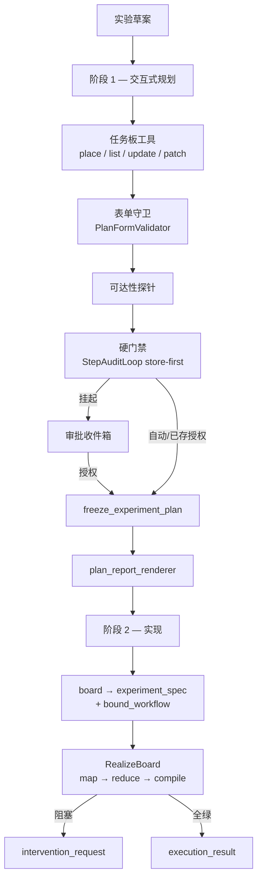

# Plan Mode 架构

`PlanOrchestrator` 把自然语言实验草案变成：**任务板（task board）**、经人审
批的计划报告，以及（默认）**实现（realize）** 后的工作流——绑定任务 → 按任务
代码生成与自修复 → 仅编译的 dry-run。这是 `molexp.harness` 里**唯一**交付的
规划流水线。

CLI（`molexp plan`）与服务端（`POST /plan-tasks`）都经
`services.plan_runtime.drive_plan_mode` 驱动同一路径，彼此不互调。

Harness 只通过 agent 的 `Router` 协议（`RouterBackedAgentGateway`）访问 LLM；
工作流引擎**不会**在 harness 进程内加载——pytest 与 compile dry-run 在
**executor 子进程**中运行。

## 两阶段（不是九步账本）



| 阶段 | 内容 | 代表产物 |
|------|------|----------|
| **1 规划** | plan workflow（draft ReAct ⟲ form_check）+ 任务板工具；可达性；硬审 | `experiment_plan`、`review_pack`、`frozen_experiment_plan`、`plan_report` |
| **2 实现** | 物化 bound → RealizeBoard | `bound_workflow`、`workflow_source`、`test_source`、`execution_result`（或 `intervention_request`） |

**没有**线性九步 `Mode` 账本。硬门禁后的恢复是 **store-first**。仅当
`PlanOrchestrator(realize=False)` 时跳过阶段 2（测试或刻意 plan-only）。

## 阶段 1 — 交互式规划

1. **规格种子** — 自由文本 → `{title, objective}`；JSON 对象原样作为不透明
   `spec`。
2. **任务板工具** — 生产实现 `DiskTaskBoard`（`run_dir/plan/task_board.json`）。
   工具：`place_task` / `list_tasks` / `inspect_*` / `update_task` /
   `complete_task` / `block_task` / `propose_plan_patch`。adapter 注入
   `ctx` 与 `board`。
3. **表单守卫** — 环内 `require_feasibility=False`；可达性在环结束后标注。
4. **硬审** — 含 **keep_tasks** 多选等表单。无审批者且无已存授权 →
   `ApprovalPendingError`。**approve 与 revise 都携带 field_values**。

## 阶段 2 — 确定性实现

冻结并出报告后：物化 `experiment_spec` + `bound_workflow`，再
`RealizeBoard`（并行按任务 codegen → reduce → compile-only）。任一任务超预算
→ 持久化 `intervention_request` 并在 compile **之前**抛错。

## 审批与恢复

门禁写在 `run_dir/harness.sqlite`。共享 decide：
`services.plan_runtime.decide_plan_review`。作用域：`approval_gate`（阶段 1）与
`intervention_request`（阶段 2）。

## 磁盘布局

```text
runs/run-<id>/
├── plan/task_board.json
├── artifacts/
└── harness.sqlite
```

## 入口

```bash
molexp plan "为电解液 X 筛选溶剂条件"
```

UI 与 CLI 同一 `drive_plan_mode(PlanOrchestrator(...), ...)`。会话进度条阶段
与 `planStages.ts` / `record._STAGE_LABELS` 对齐。

## 相关

- 操作指南：[Plan mode](../guide/plan-mode.md)
- Agent 层：[Agent 架构](agent.md)
- 工作流引擎：[Workflow 层](workflow-layer.md)
