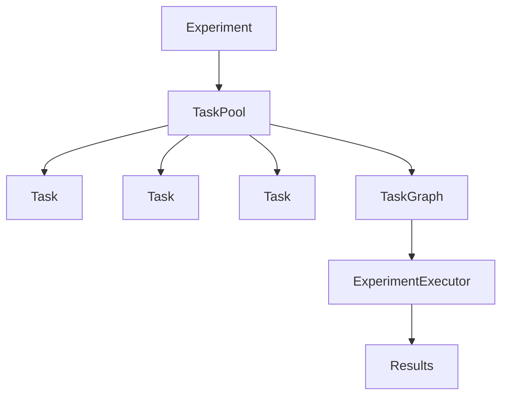

# Basic Concepts

This guide introduces the core concepts and components of MolExp.

## Architecture Overview

MolExp follows a layered architecture designed for flexibility and modularity:



## Core Components

### Task

A **Task** is the fundamental unit of work in MolExp. It represents a single computational step with:

- **Name**: Unique identifier
- **Dependencies**: Other tasks that must complete first
- **Arguments**: Command-line arguments or parameters
- **Outputs**: Expected output files or results

```python
task = mx.Task(
    name="data_analysis",
    readme="Analyze experimental data",
    args=["--input", "data.csv", "--method", "statistical"],
    kwargs={"threads": 4, "memory": "8GB"},
    deps=["data_preparation"],
    outputs=["analysis_results.json"]
)
```

### Task Types

MolExp supports different task types for various use cases:

#### Basic Task
```python
# General-purpose task
task = mx.Task(name="generic_task")
```

#### ShellTask
```python
# Execute shell commands
task = mx.ShellTask(
    name="run_script",
    commands=["python analyze.py", "mv results.txt output/"]
)
```

#### LocalTask
```python
# Local script execution
task = mx.LocalTask(
    name="local_computation",
    commands=["./run_simulation.sh", "python postprocess.py"]
)
```

#### RemoteTask
```python
# Remote execution (HPC, cloud)
task = mx.RemoteTask(
    name="hpc_job",
    commands=["ssh cluster 'sbatch job.slurm'", "scp cluster:results/* ."]
)
```

#### HamiltonTask
```python
# Hamilton dataflow integration
task = mx.HamiltonTask(
    name="hamilton_pipeline",
    modules=[data_module, analysis_module],
    config={"param1": "value1"}
)
```

### TaskPool

A **TaskPool** is a collection of related tasks that form a workflow:

```python
pool = mx.TaskPool(name="my_workflow")
pool.add_task(task1)
pool.add_task(task2)
pool.add_task(task3)

# Manage tasks
pool.remove_task("task1")
pool.update_task("task2", updated_task)
task = pool.get_task("task3")
```

### TaskGraph

The **TaskGraph** analyzes task dependencies and provides execution ordering:

```python
graph = mx.TaskGraph(task_pool)

# Validate dependencies
graph.validate_dependencies()  # Raises error if issues found

# Get execution order
execution_order = graph.topological_sort()
print(f"Execute in order: {execution_order}")

# Analyze dependencies
deps = graph.get_dependencies("task_name")
dependents = graph.get_dependents("task_name")
```

### ExperimentExecutor

The **ExperimentExecutor** manages task execution and status tracking for complete experiments:

```python
experiment = mx.Experiment(name="my_experiment", task_pool=task_pool)
executor = mx.ExperimentExecutor(experiment)

# Execute workflow
results = executor.run()

# Monitor status
print(f"Completed: {executor.is_execution_completed()}")
print(f"Failed: {executor.is_execution_failed()}")

# Get detailed status
status = executor.get_execution_status()
summary = executor.get_execution_summary()
```

### Experiment

An **Experiment** provides high-level organization and metadata:

```python
experiment = mx.Experiment(
    name="protein_folding_study",
    readme="Comprehensive analysis of protein folding dynamics"
)

# Add tasks
experiment.add_task(task1)
experiment.add_task(task2)

# Validate and save
experiment.validate_experiment()
experiment.to_yaml("experiment.yaml")

# Load later
experiment = mx.Experiment.from_yaml("experiment.yaml")
```

## Key Concepts

### Dependencies

Dependencies define the execution order of tasks:

```python
# Linear dependency chain
task1 = mx.Task(name="step1")
task2 = mx.Task(name="step2", deps=["step1"])
task3 = mx.Task(name="step3", deps=["step2"])

# Multiple dependencies
task4 = mx.Task(name="combine", deps=["step1", "step2", "step3"])
```

**Important**: Dependencies are specified by task name, not task object.

### Parallel Execution

Tasks without dependencies between them can execute in parallel:

```python
# These can run simultaneously
prep = mx.Task(name="preparation")
analysis_a = mx.Task(name="analysis_a", deps=["preparation"])
analysis_b = mx.Task(name="analysis_b", deps=["preparation"])
analysis_c = mx.Task(name="analysis_c", deps=["preparation"])
```

### Status Tracking

MolExp tracks task execution status:

- **PENDING**: Task not yet started
- **RUNNING**: Task currently executing
- **COMPLETED**: Task finished successfully
- **FAILED**: Task encountered an error

```python
# Check individual task status
status = executor.task_status["task_name"]

# Check overall workflow status
if executor.is_execution_completed():
    print("All tasks completed successfully")
elif executor.is_execution_failed():
    print("Some tasks failed")
```

### Error Handling

MolExp provides robust error handling:

```python
try:
    # Validate before execution
    graph.validate_dependencies()
    
    # Execute workflow
    results = executor.run()
    
except ValueError as e:
    print(f"Dependency error: {e}")
except RuntimeError as e:
    print(f"Execution error: {e}")
```

### Serialization

Experiments and tasks can be saved/loaded:

```python
# Save experiment
experiment.to_yaml("my_experiment.yaml")

# Load experiment
loaded_experiment = mx.Experiment.from_yaml("my_experiment.yaml")

# Save individual tasks
task.to_yaml("task.yaml")
loaded_task = mx.Task.from_yaml("task.yaml")
```

## Best Practices

### Task Design

1. **Single Responsibility**: Each task should have one clear purpose
2. **Clear Names**: Use descriptive names that indicate the task's function
3. **Explicit Dependencies**: Clearly specify all task dependencies
4. **Output Specification**: Define expected outputs for validation

### Workflow Organization

1. **Logical Grouping**: Group related tasks into experiments
2. **Modularity**: Design reusable task components
3. **Documentation**: Include meaningful readme text for tasks and experiments
4. **Validation**: Always validate workflows before execution

### Error Prevention

1. **Dependency Validation**: Check for missing dependencies and cycles
2. **Resource Management**: Consider resource requirements and constraints
3. **Testing**: Test workflows with sample data before production runs
4. **Monitoring**: Implement progress monitoring for long-running workflows

## Next Steps

- **[Task Guide](../user_guide/tasks.md)**: Detailed task configuration
- **[Workflow Guide](../user_guide/workflows.md)**: Advanced workflow patterns  
- **[Examples](../examples/basic_usage.md)**: Practical usage examples
- **[API Reference](../api/tasks.md)**: Complete API documentation
